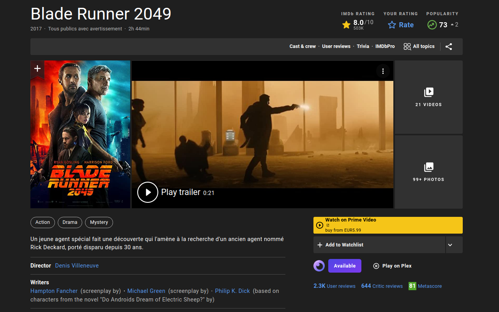

# Overseerr Assistant

Overseerr Assistant is a browser extension for [Overseerr](https://github.com/sct/overseerr) and [Jellyseerr](https://github.com/Fallenbagel/jellyseerr). It provides an integration for most popular media websites.

Features:
- One-click Overseerr requests directly from media websites
- One-click access to available media on Plex
- Monitor requests status
- Support for both movies and TV shows

Supported media websites:
- [TMDB](https://www.themoviedb.org/)
- [IMDb](https://www.imdb.com/)
- [TVDB](https://thetvdb.com/)
- [Rotten Tomatoes](https://www.rottentomatoes.com/)
- [Plex Discover](https://app.plex.tv/desktop/#!/media/tv.plex.provider.discover?source=home)
- [Letterboxd](https://letterboxd.com/)
- [JustWatch](https://www.justwatch.com/)
- [Trakt.tv](https://trakt.tv/)
- [Taste.io](https://www.taste.io/)
- [Allociné](https://www.allocine.fr/)
- [Senscritique](https://www.senscritique.com/)
- [Filmow](https://filmow.com/)

## Install

**[Available on the Chrome Web Store](https://chrome.google.com/webstore/detail/hopnjiadheaagfhpipecoamoegijhnij)**  
**[Available on Firefox Add-ons](https://addons.mozilla.org/firefox/addon/overseerr-assistant/)**  

## Screenshots

### TMDB

### IMDb

## License

Overseerr Extension is licensed under the [MIT License](LICENSE).
